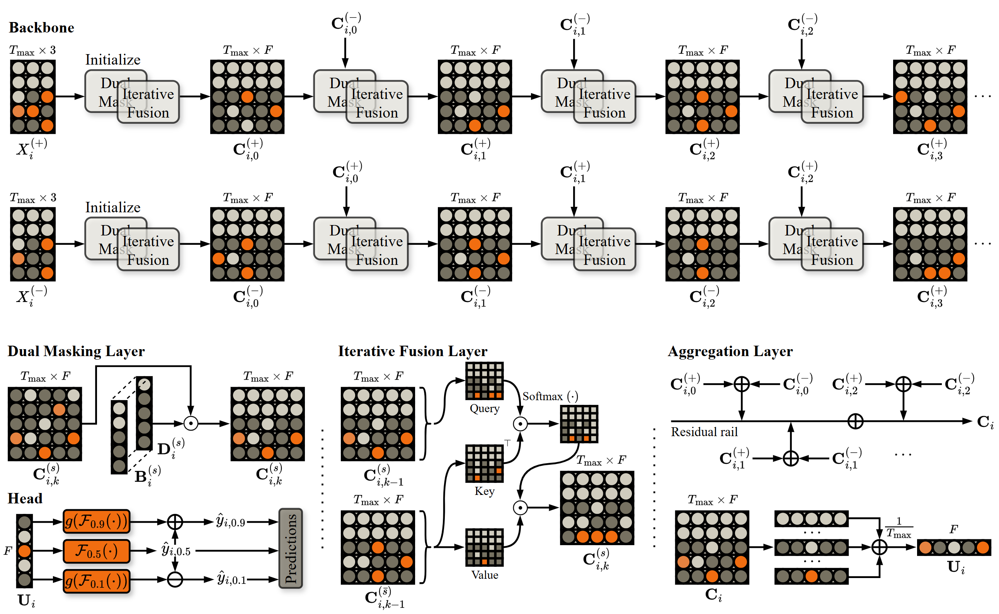

# OrderFusion
Encoding Orderbook for End-to-End Probabilistic Forecasting of Intraday Electricity Price

🌌 Summary page: https://runyao-yu.github.io/OrderFusion/

🌃 Paper link: https://arxiv.org/pdf/2502.06830




---


## 🚀 Quick Start

We open-source all code for preprocessing, modeling, and analysis.  
The project directory is structured as follows:

    OrderFusion/
    ├── Data/
        |- Country (e.g. Germany)
            |- Intraday Continuous
                |- Orders
                    |- Year (e.g. 2023)
                        |- Month (e.g. 01)
                        |- Month (e.g. 02)
                        |- Month (e.g. 03)
                        ...
                    ...
    ├── Model/
    ├── Result/
    ├── OrderFusion.py
    ├── Main.py
    ├── README.md

The file `README.md` specifies the required package versions.

To facilitate reproducibility and accessibility, we have streamlined the entire pipeline into just three simple steps:

### ✅ Step 1: Prepare the Folder Structure
Place the purchased orderbook data into `Data` folder. Purchase source: https://webshop.eex-group.com/epex-spot-public-market-data (Several data types are available. For example, the “Continuous
Anonymous Orders History” for Germany costs 325 EUR/month.)

### ✅ Step 2: Run the Pipeline

Run `Main.py` to:
- Process the orderbook data to generate intermediate data
- Train, validate, and test the OrderFusion model

The script `OrderFusion.py` contains all necessary functions and classes.

### ✅ Step 3: Check Results

After execution, check:
- `Model/` for saved model weights  
- `Result/` for evaluation metrics and outputs


---


## 📦 Environment & Dependencies

This project has been tested with the following environment:

- **Python 3.9.20**
- `numpy==1.25.2`
- `pandas==2.1.4`
- `scikit-learn==1.5.1`
- `tensorflow==2.16.2`
- `protobuf>=3.19.0`
- `h5py>=3.1.0`
- `joblib`
- `setuptools`
- `tqdm`

Use the following comment to pip install:

```bash
pip install numpy==1.25.2 pandas==2.1.4 scikit-learn==1.5.1 scipy==1.13.1 tensorflow==2.16.2 protobuf>=3.19.0 h5py>=3.1.0 joblib setuptools tqdm

