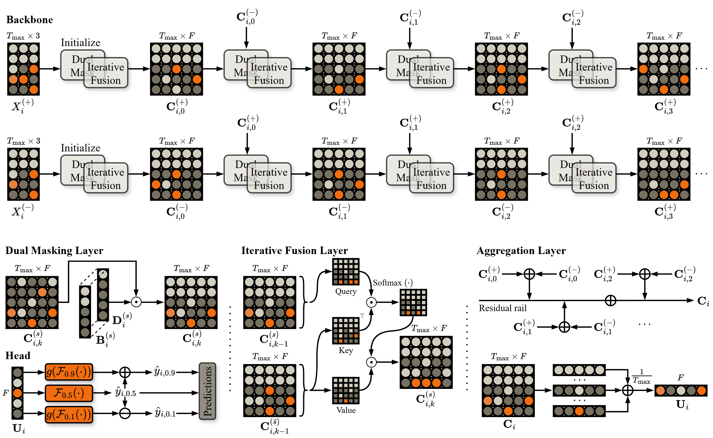

# OrderFusion
Encoding Orderbook for End-to-End Probabilistic Intraday Electricity Price Forecasting

**Accepted to Advanced Engineering Informatics 2026 (IF=11.5)**.

🦊 Summary page: https://runyao-yu.github.io/OrderFusion/

🌋 Paper link: https://www.sciencedirect.com/science/article/pii/S1474034626008232




---

## 📢 News

🚀 **Stay tuned! We are developing OrderFusion+ — the next-generation version of OrderFusion (OrderFusion v2).**

OrderFusion+ extends the original framework from price-index forecasting to **price-trajectory forecasting**, while incorporating richer market information, including neighboring products, fundamental features, and calendar features.

🌐 OrderFusion+ repository *(coming soon)*: [github.com/runyao-yu/OrderFusion-Plus](https://github.com/runyao-yu/OrderFusion-Plus)

| Capability | OrderFusion | OrderFusion+ |
| :--- | :---: | :---: |
| **Forecasting paradigm** |  |  |
| Pointwise forecasting | ✓ | ✓ |
| Probabilistic forecasting | ✓ | ✓ |
| **Forecasting target** |  |  |
| Price index forecasting | ✓ | ✓ |
| Price trajectory forecasting | ✗ | ✓ |
| **Input information** |  |  |
| Orderbook data input | ✓ | ✓ |
| Neighboring product input | ✗ | ✓ |
| Fundamental feature input | ✗ | ✓ |
| Calendar feature input | ✗ | ✓ |

---

## 🚀 Quick Start
 
The project directory is structured as follows:


    ├── Data/
    │   └── Country (e.g. Germany)/
    │       └── Intraday Continuous/
    │           └── Orders/
    │               └── Year (e.g. 2023)/
    │                   ├── Month (e.g. 01)/
    │                   ├── Month (e.g. 02)/
    │                   ├── Month (e.g. 03)/
    │                   └── ...
    ├── Figure/
    ├── Model/
    ├── Your_notebook.ipynb

To facilitate reproducibility and accessibility, we have streamlined the entire pipeline into just few simple steps:

⚡️ (1) Create empty folders `Data`, `Figure` and `Model` in the parent folder;

⚡️ (2) Place the purchased orderbook data into `Data` folder. Purchase source: https://webshop.eex-group.com/epex-spot-public-market-data (Several data types are available. For example, the “Continuous Anonymous Orders History” for Germany costs 325 EUR/month.);

⚡️ (3) Create your empty notebook ended with `.ipynb`;

⚡️ (4) Run `pip install OrderFusion` in your notebook;

Go through `Tutorial.ipynb` to understand the usage, e.g.:
- `OrderFusion.read_data()` to read data;
- `OrderFusion.optimize_model()` to train and optimize model;
- `OrderFusion.evaluate_model()` to produce various testing metrics;
- `OrderFusion.plot_forecasts()` to generate figure of forecasts.

## 💾 Installation Requirements

Running the `pip install OrderFusion` automatically install the required 
packages. The detailed information is as follows:

- The file **`requirements.txt`** lists all dependencies with fixed versions used in this project. 
- The recommended **Python version** is **3.10**, since TensorFlow 2.16.2 officially supports only Python 3.10 – 3.11. 
- Required Packages:

```txt
tensorflow==2.16.2
numpy==1.26.4
pandas==2.2.2
scikit-learn==1.5.2
matplotlib==3.7.0
imageio==2.26.0
Pillow==10.4.0
joblib==1.4.2
natsort==8.4.0
tqdm==4.66.5
ipython==8.10.0