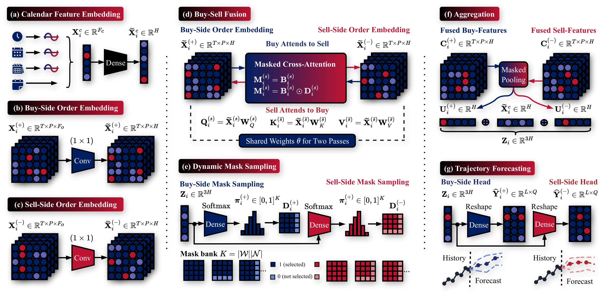

# OrderFusion

An Open-Source Deep Neural Network for Intraday Price Forecasting

Our **Project page** below shows an overview of the work, feature comparison of OrderFusion and OrderFusion+, interactive visualization, and other information.

https://runyao-yu.github.io/OrderFusion/

🏆🏆🏆



## 📢 News

**18 Sep 2026.** Inspired by the discussion with Leo Semmelmann, Joseph Cary, and Derek W. Bunn, we have upgraded OrderFusion from v1 to v2 (**OrderFusion+**). OrderFusion+ is our latest and most powerful forecasting tool for continuous intraday market. The model is now able to take neighboring products as input, reflects dynamically on the market condition, and produces probabilisitic buy-sell price trajectory forecasts with uncertainties.

**5 Aug 2026.** OrderFusion is accepted by Advanced Engineering Informatics (IF=11.5). OrderFusion utilizes cross-attention to model the buy-sell interaction and is designed for probabilisitic price index forecasting. 


## 💾 Data source

The orderbook data can be purchased from EPEX SPOT: https://webshop.eex-group.com/epex-spot-public-market-data

We publish the derived information, i.e. our forecasts and the extracted VWAP trajectories, to help the energy community benchmark models and develop novel trading strategies. They can only be used for research purpose and the usage must be approved by the authors of OrderFusion. The single file `Forecasts/orderfusion_forecasts_2024.npz` holds the forecasts of all models for the full test year 2024, and `Forecasts/read_forecasts.py` retrieves any of them:

```python
from read_forecasts import Forecasts
f = Forecasts("orderfusion_forecasts_2024.npz")
f.get("OrderFusionPlus", "2024-07-23 18:00", origin=-180)
```


## 🚀 Repository

    ├── OrderFusion/      model.py, preprocessing.py, evaluation.py, fake_data_generation.py
    ├── Forecasts/        forecasts of all models for 2024 and the Python reader
    ├── Project_page/     project page
    ├── Tutorial.ipynb    preprocessing, modeling, and evaluation step by step
    └── README.md

## 🧰 Required packages

- Python 3.10.15
- PyTorch 2.3.0
- NumPy 1.26.4
- pandas 2.2.2
- PyArrow 15.0.0
- Matplotlib 3.7.0
- JupyterLab 3.5.3
- Notebook 6.5.2
- IPykernel 6.19.2

Install them with `pip install -r requirements.txt`. For training we recommend a CUDA-capable NVIDIA GPU with at least 16 GB VRAM (NVIDIA A100 80 GB recommended).

## 📖 Citation

If you find our work useful or use our forecasts, please cite us.

OrderFusion+: tba

OrderFusion:

```bibtex
@article{YU2026105131,
  title   = {OrderFusion: Encoding orderbook for end-to-end probabilistic intraday electricity price forecasting},
  journal = {Advanced Engineering Informatics},
  volume  = {76},
  pages   = {105131},
  year    = {2026},
  issn    = {1474-0346},
  doi     = {https://doi.org/10.1016/j.aei.2026.105131},
  url     = {https://www.sciencedirect.com/science/article/pii/S1474034626008232},
  author  = {Runyao Yu and Yuchen Tao and Fabian Leimgruber and Tara Esterl and Jochen Stiasny and Derek W. Bunn and Qingsong Wen and Hongye Guo and Jochen L. Cremer},
}
```
