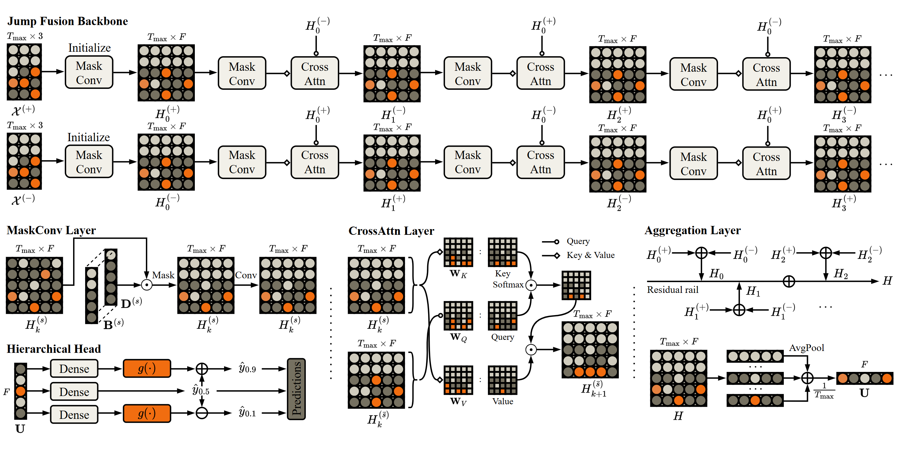

{: style="float:right; height:84px; margin-left:12px;" }
# Foundation Model for Probabilistic Intraday Electricity Price Forecasting
<div style="clear:both;"></div>

[](https://arxiv.org/abs/2502.06830)
[](https://github.com/runyao-yu/OrderFusion)
[](https://www.linkedin.com/in/runyao-yu/)
[](mailto:runyao.yu@tudelft.nl)

**Authors:** Runyao Yu, Yuchen Tao, Fabian Leimgruber, Tara Esterl, Jochen L. Cremer
{: style="float:left; height:128px;" }

## Abstract
We propose an end-to-end foundation model called OrderFusion, tailored for the intraday electricity market. 

OrderFusion encodes the orderbook into a 2.5D representation and employs a jump fusion backbone to model buy-sell dynamics without the need for domain feature extraction. The head anchors on the median quantile and hierarchically estimates other quantiles through constrained residuals, ensuring monotonicity. 

We conduct extensive experiments and ablation studies on three key price indices (ID1, ID2, and ID3) using three years of orderbook data from the German market. To assess the generalizability of the proposed foundation model, we further evaluate it on the Austrian market. The results confirm that OrderFusion remains accurate, reliable, and generalizable across different market settings.

## Model Structure


## Citation

```bibtex
@misc{yu2025OrderFusion,
  title         = {OrderFusion: Foundation Model for Probabilistic Intraday Electricity Price Forecasting Using Orderbook},
  author        = {Yu, Runyao and Tao, Yuchen and Leimgruber, Fabian and Esterl, Tara and Cremer, Jochen L.},
  year          = {2025},
  eprint        = {2502.06830},
  archivePrefix = {arXiv},
  primaryClass  = {q-fin.CP},
  url           = {https://arxiv.org/abs/2502.06830}
}
```